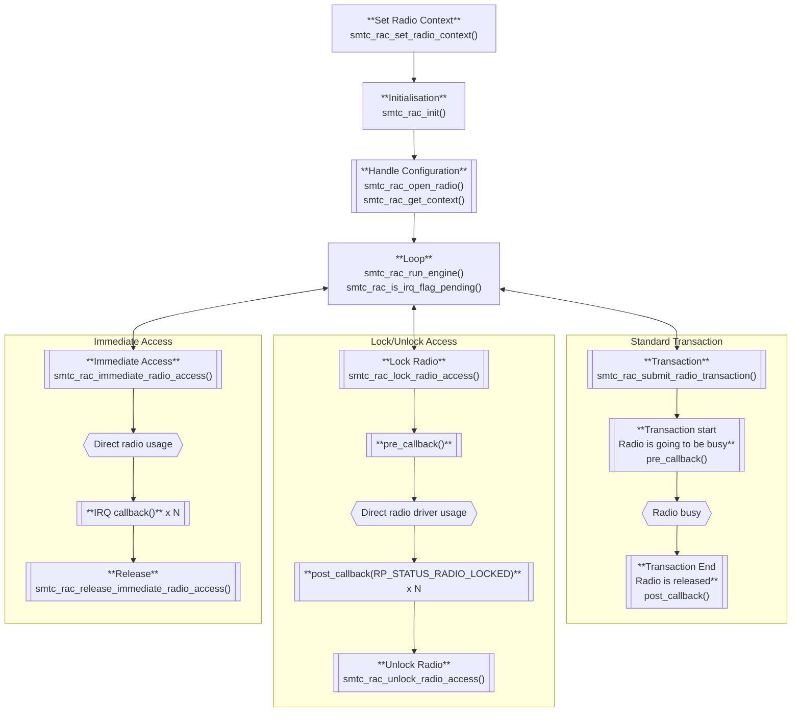

# USP RAC API

This library provides an abstraction layer for scheduling and managing radio access for LoRa, FSK, LR-FHSS, FLRC, and ranging operations, using Semtech's radio planner. It allows applications to request radio access, configure radio transmissions and receptions, and schedule radio operations with different priorities.

## Features

- Priority-based radio access management
- Multi-modulation support: LoRa, FSK, LR-FHSS, FLRC, and FLRC Burst
- LoRa transmission, reception, and ranging support
- Scheduling of radio operations (scheduled or ASAP)
- Callback support for asynchronous operations
- Direct radio driver access (lock/unlock mechanism)
- Immediate radio access for time-critical operations
- Listen Before Talk (LBT), Channel Activity Detection (CAD), and Continuous Wave (CW) support
- Integration with Semtech's radio planner

## Data Structures

### `smtc_rac_context_t`
Complete context for a radio transaction:
- `modulation_type`: Type of modulation (LoRa, FSK, LR-FHSS, FLRC, or FLRC Burst)
- `radio_params`: Union containing modulation-specific parameters (`lora`, `fsk`, `lrfhss`, `flrc`, `flrc_burst`)
- `smtc_rac_data_buffer_setup`: Data buffer setup for the transaction
- `scheduler_config`: Scheduling and callback configuration
- `smtc_rac_data_result`: Data results from the transaction
- `lbt_context`: LBT context for Listen Before Talk operations (optional)
- `cad_context`: CAD context for Channel Activity Detection operations (optional)
- `cw_context`: CW context for Continuous Wave operations (optional)
- `keep_radio_awake`: Flag to indicate if the radio should stay alive after the transaction is completed

Due to the constraints on `smtc_rac_data_buffer_setup`, this struct must be persistent between `smtc_rac_submit_radio_transaction()` and the post transaction callback.

### `smtc_usp_rac_version_t`
USP RAC API version structure:
- `major`: Major version
- `minor`: Minor version
- `patch`: Patch version

### `smtc_rac_modulation_type_t`
Modulation types supported by RAC:
- `SMTC_RAC_MODULATION_LORA` - LoRa modulation
- `SMTC_RAC_MODULATION_FSK` - FSK/GFSK modulation
- `SMTC_RAC_MODULATION_LRFHSS` - LR-FHSS modulation (transmission only)
- `SMTC_RAC_MODULATION_FLRC` - FLRC modulation
- `SMTC_RAC_MODULATION_FLRC_BURST` - FLRC burst modulation (multiple packet transmission)

### `smtc_rac_scheduling_t`
Scheduling modes for the request:
- `SMTC_RAC_SCHEDULED_TRANSACTION` - Transaction starts at scheduled time if possible, abort if not
- `SMTC_RAC_ASAP_TRANSACTION` - Transaction starts at scheduled time if possible, ASAP after it if not

### `smtc_rac_lora_syncword_t`
Synchronization word for LoRa communication:
- `LORA_PRIVATE_NETWORK_SYNCWORD` (0x12) - Synchronization word used for private network
- `LORA_PUBLIC_NETWORK_SYNCWORD` (0x34) - Synchronization word used for public network

### `smtc_rac_data_buffer_setup_t`
Data buffer setup for a radio operation:
- `tx_payload_buffer`: Pointer to transmission payload buffer
- `size_of_tx_payload_buffer`: Size of TX buffer in bytes
- `rx_payload_buffer`: Pointer to reception payload buffer
- `size_of_rx_payload_buffer`: Size of RX buffer in bytes

This struct must still be valid when the post transaction callback is invoked.
Must be persistent between `smtc_rac_submit_radio_transaction()` and the post transaction callback.

### `smtc_rac_radio_lora_params_t`
Configuration for a LoRa radio operation:
- `is_tx`: Set to true for transmission, false for reception
- `is_ranging_exchange`: Set to true for ranging operations
- `rttof`: Ranging-specific parameters (see `smtc_rac_rttof_params_t`)
- `frequency_in_hz`: Frequency in Hz
- `sf`: Spreading factor for LoRa modulation
- `bw`: Bandwidth for LoRa modulation
- `cr`: Coding rate for LoRa modulation
- `preamble_len_in_symb`: Preamble length in symbols
- `header_type`: Packet header type (explicit or implicit)
- `invert_iq_is_on`: Enable/disable IQ inversion
- `crc_is_on`: Enable/disable CRC
- `sync_word`: LoRa sync word (see `smtc_rac_lora_syncword_t`)
- `tx_power_in_dbm`: Transmission power in dBm (TX only)
- `tx_size`: Size of TX payload to transmit in bytes (TX only)
- `rx_timeout_ms`: RX timeout in ms (RX only)
- `symb_nb_timeout`: Number of symbols to wait for the preamble (RX only)
- `max_rx_size`: Maximum size of RX payload buffer in bytes (the radio will stop RX after max_rx_size)

### `smtc_rac_rttof_params_t`
RTToF (Round Trip Time of Flight) parameters for ranging operations:
- `request_address`: Ranging request address
- `delay_indicator`: Delay indicator for ranging timing
- `response_symbols_count`: Number of symbols in the ranging response
- `bw_ranging`: Bandwidth used for ranging

### `smtc_rac_radio_fsk_params_t`
Configuration for a FSK radio operation:
- `is_tx`: Set to true for transmission, false for reception
- `tx_size`: Size of TX payload in bytes
- `max_rx_size`: Maximum size of RX payload buffer in bytes
- `frequency_in_hz`: Frequency in Hz
- `tx_power_in_dbm`: Transmission power in dBm
- `br_in_bps`: Bit rate in bits per second
- `fdev_in_hz`: Frequency deviation in Hz
- `bw_dsb_in_hz`: Bandwidth (double-sided) in Hz
- `pulse_shape`: Pulse shaping filter
- `header_type`: Packet header type (fixed or variable length)
- `preamble_len_in_bits`: Length of the preamble in bits
- `preamble_detector`: Preamble detector configuration
- `sync_word_len_in_bits`: Synchronization word length in bits
- `crc_type`: CRC type configuration
- `dc_free`: DC-free encoding type
- `sync_word`: Pointer to synchronization word array
- `whitening_seed`: Whitening seed value
- `crc_seed`: CRC seed value
- `crc_polynomial`: CRC polynomial value
- `rx_timeout_ms`: RX timeout in ms

### `smtc_rac_radio_lrfhss_params_t`
Configuration for a LR-FHSS radio operation (transmission only):
- `is_tx`: Must be true (LR-FHSS is transmission-only)
- `tx_size`: Size of TX payload in bytes
- `frequency_in_hz`: Center frequency in Hz
- `tx_power_in_dbm`: Transmission power in dBm
- `coding_rate`: Coding rate for LR-FHSS modulation
- `bandwidth`: Bandwidth for LR-FHSS modulation
- `grid`: Grid step for frequency hopping
- `enable_hopping`: Enable frequency hopping
- `sync_word`: Pointer to synchronization word array (4 bytes)
- `device_offset`: Device offset for frequency calculation
- `header_count`: Header count (auto-calculated from coding rate)
- `hop_sequence_id`: Hop sequence ID (auto-generated)

### `smtc_rac_radio_flrc_params_t`
Configuration for a FLRC radio operation:
- `is_tx`: Set to true for transmission, false for reception
- `tx_size`: Size of TX payload in bytes
- `max_rx_size`: Maximum size of RX payload buffer in bytes
- `frequency_in_hz`: Frequency in Hz
- `rx_frequency_offset_in_hz`: Frequency offset for reception in Hz (to compensate frequency deviation)
- `tx_power_in_dbm`: Transmission power in dBm
- `raw_bit_rate`: Raw bit rate
- `cr`: Coding rate
- `pulse_shape`: Pulse shaping filter
- `preamble_len`: Length of the preamble
- `sync_word_len`: Sync word length configuration
- `tx_syncword_index`: TX sync word index to use
- `match_sync_word`: RX sync word match configuration
- `pld_is_fix`: Fixed (true) or variable (false) length
- `crc_type`: CRC type configuration
- `sync_word[3]`: Pointer to synchronization word array (expected 4 bytes for each sync word)
- `crc_seed`: CRC seed value
- `crc_polynomial`: CRC polynomial value
- `rx_timeout_ms`: RX timeout in ms

### `smtc_rac_radio_flrc_burst_params_t`
Configuration for a FLRC burst radio operation (multiple packet transmission):
- `is_tx`: Set to true for transmission, false for reception
- `burst_tx_size`: Size of the bursted TX payloads in bytes
- `burst_rx_size`: Size of the bursted RX payloads in bytes
- `max_rx_size`: Maximum size of one payload received by the radio
- `tx_fifo_payload_buffer[N]`: Pointers to generated fragments of the bursted TX payload
- `tx_fifo_payload_length[N]`: Lengths of the generated fragments in bytes
- `size_of_tx_fifo_payload_buffer[N]`: Sizes of the TX payload buffers in bytes
- `frequency_in_hz`: Frequency in Hz
- `rx_frequency_offset_in_hz`: Frequency offset for reception in Hz
- `tx_power_in_dbm`: Transmission power in dBm
- `raw_bit_rate`: Raw bit rate
- `cr`: Coding rate
- `pulse_shape`: Pulse shaping filter
- `preamble_len`: Length of the preamble
- `sync_word_len`: Sync word length configuration
- `tx_syncword_index`: TX sync word index to use (1, 2, or 3)
- `match_sync_word`: RX sync word match configuration
- `pld_is_fix`: Fixed (true) or variable (false) length
- `crc_type`: CRC type configuration
- `sync_word[3]`: Pointer to synchronization word array (expected 4 bytes for each sync word)
- `crc_seed`: CRC seed value
- `crc_polynomial`: CRC polynomial value
- `rx_burst_timeout_ms`: Timeout for receiving all the burst data in ms

Where `N` is `RAC_FLRC_BURST_NUMBER_OF_TX_FIFO_PTR` (default: 2).

### `smtc_rac_scheduler_config_t`
Scheduling configuration:
- `start_time_ms`: Scheduled start time in milliseconds (absolute time). For ASAP, 0 is not recommended; use `smtc_modem_hal_get_time_in_ms()` for NOW, or add a delay to it
- `duration_time_ms`: Duration time in milliseconds
- `scheduling`: Scheduling mode (`SMTC_RAC_SCHEDULED_TRANSACTION` or `SMTC_RAC_ASAP_TRANSACTION`)
- `callback_pre_radio_transaction`: Callback called just before radio transaction (can be NULL)
- `callback_post_radio_transaction`: Callback called just after radio transaction with `rp_status_t` parameter (must not be NULL)

### `smtc_rac_data_result_t`
Data results from a radio operation:
- `rx_size`: Size of received payload in bytes
- `rssi_result`: Received Signal Strength Indicator (RSSI) value
- `snr_result`: Signal-to-Noise Ratio (SNR) value (LoRa only, not applicable for other modulations)
- `radio_end_timestamp_ms`: Timestamp of radio event end
- `radio_start_timestamp_ms`: Timestamp of radio event start
- `ranging_result`: Ranging result structure (for RTToF)
- `lora_freq_offset_hz`: LoRa frequency offset of the last packet received in Hz

### `smtc_rac_lbt_context_t`
Listen Before Talk context (optional):
- `lbt_enabled`: Flag to indicate if LBT is enabled
- `listen_duration_ms`: Duration of listening period
- `threshold_dbm`: RSSI threshold for busy/free detection
- `bandwidth_hz`: Bandwidth for RSSI measurement
- `rssi_inst_dbm`: (result) Last instantaneous RSSI
- `channel_busy`: (result) True if channel is busy

### `smtc_rac_cad_radio_params_t`
Channel Activity Detection context (optional):
- `cad_enabled`: Flag to indicate if CAD is enabled
- `cad_symb_nb`: Number of CAD symbols
- `cad_exit_mode`: CAD exit mode
- `cad_timeout_in_ms`: CAD timeout in ms
- `sf`: LoRa Spreading Factor
- `bw`: LoRa Bandwidth
- `rf_freq_in_hz`: Frequency in Hz
- `invert_iq_is_on`: LoRa IQ polarity setup

### `smtc_rac_cw_context_t`
Continuous Wave context (optional):
- `cw_enabled`: Flag to indicate if CW is enabled
- `infinite_preamble`: Flag to indicate if infinite preamble is enabled

## Typical RAC Types

### `smtc_rac_priority_t`
Defines the priority for radio access requests:
- `RAC_VERY_HIGH_PRIORITY`
- `RAC_HIGH_PRIORITY`
- `RAC_MEDIUM_PRIORITY`
- `RAC_LOW_PRIORITY`
- `RAC_VERY_LOW_PRIORITY`

### `smtc_rac_return_code_t`
Return codes for API functions:
- `SMTC_RAC_SUCCESS`
- `SMTC_RAC_ERROR`
- `SMTC_RAC_BUSY`
- `SMTC_RAC_TIMEOUT`
- `SMTC_RAC_INVALID_PARAMETER`
- `SMTC_RAC_NOT_SUPPORTED`
- `SMTC_RAC_NOT_INITIALIZED`
- `SMTC_RAC_NOT_IMPLEMENTED`

### `rp_status_t` Values
The `callback_post_radio_transaction` receives an `rp_status_t` parameter indicating the result of the radio operation:
- `RP_STATUS_RX_CRC_ERROR`: RX packet received with CRC error
- `RP_STATUS_CAD_POSITIVE`: Channel Activity Detection detected activity
- `RP_STATUS_CAD_NEGATIVE`: Channel Activity Detection detected no activity
- `RP_STATUS_TX_DONE`: Transmission completed successfully
- `RP_STATUS_RX_PACKET`: RX packet received successfully
- `RP_STATUS_RX_TIMEOUT`: RX operation timed out
- `RP_STATUS_LBT_FREE_CHANNEL`: Listen Before Talk detected free channel
- `RP_STATUS_LBT_BUSY_CHANNEL`: Listen Before Talk detected busy channel
- `RP_STATUS_WIFI_SCAN_DONE`: WiFi scan operation completed
- `RP_STATUS_GNSS_SCAN_DONE`: GNSS scan operation completed
- `RP_STATUS_TASK_ABORTED`: Radio task was aborted
- `RP_STATUS_TASK_INIT`: Radio task initialization
- `RP_STATUS_LR_FHSS_HOP`: LR-FHSS frequency hop occurred
- `RP_STATUS_RTTOF_REQ_DISCARDED`: RTToF request was discarded
- `RP_STATUS_RTTOF_RESP_DONE`: RTToF response completed
- `RP_STATUS_RTTOF_EXCH_VALID`: RTToF exchange was valid
- `RP_STATUS_RTTOF_TIMEOUT`: RTToF operation timed out
- `RP_STATUS_RADIO_LOCKED`: Radio access has been locked successfully
- `RP_STATUS_RADIO_UNLOCKED`: Radio access has been unlocked

### Constants
- `RAC_INVALID_RADIO_ID` (0xFF): Returned by `smtc_rac_open_radio()` when the request fails

## API Functions

### Core Functions

#### `smtc_rac_return_code_t smtc_rac_get_version(smtc_usp_rac_version_t *version);`
Gets the USP RAC API version.

#### `void smtc_rac_init(void);`
Initializes the RAC. Must be called before any other API function. `smtc_rac_set_radio_context()` must be called before this function.

#### `void smtc_rac_run_engine(void);`
Runs the RAC engine. Should be called regularly to process scheduled operations.

#### `bool smtc_rac_is_irq_flag_pending(void);`
Checks if a radio IRQ is pending.

### Radio Access Management

#### `uint8_t smtc_rac_open_radio(smtc_rac_priority_t priority);`
Requests radio access with a given priority. Returns a radio access ID, or `RAC_INVALID_RADIO_ID` if the request fails.

#### `smtc_rac_return_code_t smtc_rac_close_radio(uint8_t radio_access_id);`
Closes the radio access and releases resources associated with the given radio access ID.

#### `smtc_rac_return_code_t smtc_rac_submit_radio_transaction(uint8_t radio_access_id);`
Submits a radio transaction for execution by the radio planner using the specified radio access ID.

#### `smtc_rac_return_code_t smtc_rac_abort_radio_submit(uint8_t radio_access_id);`
Aborts a pending radio request associated with the given radio access ID.

### Context and Driver Access

#### `smtc_rac_context_t *smtc_rac_get_context(uint8_t radio_access_id);`
Gets the RAC context for a specific radio access ID. All fields are initialized to 0. The caller is responsible for setting `modulation_type`, the associated `radio_params`, `smtc_rac_data_buffer_setup`, and `scheduler_config` (except `duration_time_ms`) before calling `smtc_rac_submit_radio_transaction()`. The results of the transaction will be available in `smtc_rac_data_buffer_setup`, `smtc_rac_data_result`, and `scheduler_config.duration_time_ms` when the post transaction callback is invoked.

#### `radio_planner_t *smtc_rac_get_rp(void);`
Returns a pointer to the internal radio planner instance.

#### `ralf_t *smtc_rac_get_radio(void);`
Returns a pointer to the ralf_t radio instance.

#### `void *smtc_rac_get_radio_driver_context(void);`
Returns a pointer to the radio driver context instance.

#### `void *smtc_rac_get_context_private(uint8_t radio_access_id);`
Gets the private context for a specific radio access ID.

#### `void smtc_rac_set_context_private(uint8_t radio_access_id, void *context_private);`
Sets the private context for a specific radio access ID.

#### `void smtc_rac_set_radio_context(const void *radio_ctx);`
Sets the radio context (used in radio implementation, for example GPIO management or reset). Must be called before `smtc_rac_init()`.

### Modulation-Specific Operations

#### `smtc_rac_return_code_t smtc_rac_lora(uint8_t radio_access_id);`
Enqueue a LoRa or ranging task for execution by the radio planner.

#### `smtc_rac_return_code_t smtc_rac_fsk(uint8_t radio_access_id);`
Enqueue a FSK task for execution by the radio planner.

#### `smtc_rac_return_code_t smtc_rac_lrfhss(uint8_t radio_access_id);`
Enqueue a LR-FHSS transmission task for execution by the radio planner. Note: LR-FHSS is transmission-only.

#### `smtc_rac_return_code_t smtc_rac_flrc(uint8_t radio_access_id);`
Enqueue a FLRC task for execution by the radio planner.

#### `smtc_rac_return_code_t smtc_rac_flrc_burst(uint8_t radio_access_id);`
Enqueue a FLRC burst task (multiple packet transmission) for execution by the radio planner.

#### `smtc_rac_return_code_t smtc_rac_flrc_burst_rx_done(uint8_t radio_access_id);`
Release the radio access for a FLRC burst RX task.

### Direct Radio Access (Lock/Unlock)

#### `smtc_rac_return_code_t smtc_rac_lock_radio_access(uint8_t radio_access_id, smtc_rac_scheduler_config_t scheduler_config);`
Requests direct access to the radio driver. The radio access is locked if the request is granted — RAC will call the `callback_pre_radio_transaction` where the radio can be prepared. When the transaction finishes, RAC calls `callback_post_radio_transaction` with `RP_STATUS_RADIO_LOCKED` if successful, or `RP_STATUS_TASK_ABORTED` if aborted. At this stage the radio is still locked and can continue to be used until `smtc_rac_unlock_radio_access()` is called.

#### `smtc_rac_return_code_t smtc_rac_unlock_radio_access(uint8_t radio_access_id);`
Unlocks the radio access previously acquired with `smtc_rac_lock_radio_access()`. If called without a prior lock, `callback_post_radio_transaction` will be called with `RP_STATUS_RADIO_UNLOCKED`.

### Immediate Radio Access

#### `smtc_rac_return_code_t smtc_rac_immediate_radio_access(smtc_rac_priority_t priority, void (*irq_callback)(void));`
Requests immediate and unlimited access to the radio with a given priority. If there is no existing radio task, the access is granted. If the priority is higher than an existing radio task currently managed, the current task is aborted and the access is granted. Otherwise, the request is refused. No other concurrent access is possible (whatever the priority) until `smtc_rac_release_immediate_radio_access()` is called.

#### `smtc_rac_return_code_t smtc_rac_release_immediate_radio_access(void);`
Releases the immediate radio access previously obtained with `smtc_rac_immediate_radio_access()`.

### Active Timeout Management

#### `smtc_rac_return_code_t smtc_rac_set_active_time_out(uint8_t radio_access_id, uint32_t active_time_out_time_ms);`
Sets the active timeout for a radio task.

#### `smtc_rac_return_code_t smtc_rac_release_active_time_out(uint8_t radio_access_id);`
Releases the active timeout for a radio task.

## API Workflow




## Example Usage

```c
void my_pre_callback(void) {
    LOG("Radio transaction starting...\n");
}

void my_post_callback(rp_status_t status) {
    LOG("Radio transaction completed with status: %d\n", status);
    if (status == RP_STATUS_TX_DONE) {
        LOG("Transmission successful!\n");
    } else if (status == RP_STATUS_RX_PACKET) {
        LOG("Packet received!\n");
    }
}

// Set radio context (must be called before init)
smtc_rac_set_radio_context(my_radio_context);

// Initialize RAC
smtc_rac_init();

// Request radio access
uint8_t radio_id = smtc_rac_open_radio(RAC_HIGH_PRIORITY);

// Get context and configure parameters
smtc_rac_context_t *ctx = smtc_rac_get_context(radio_id);
ctx->modulation_type = SMTC_RAC_MODULATION_LORA;
ctx->radio_params.lora.is_tx = true;
ctx->radio_params.lora.frequency_in_hz = 868100000;
ctx->radio_params.lora.tx_power_in_dbm = 14;
ctx->radio_params.lora.tx_size = payload_size;
ctx->radio_params.lora.sf = RAL_LORA_SF7;
ctx->radio_params.lora.bw = RAL_LORA_BW_125_KHZ;
ctx->radio_params.lora.cr = RAL_LORA_CR_4_5;
ctx->smtc_rac_data_buffer_setup.tx_payload_buffer = payload_buffer;
ctx->smtc_rac_data_buffer_setup.size_of_tx_payload_buffer = sizeof(payload_buffer);
ctx->scheduler_config.start_time_ms = smtc_modem_hal_get_time_in_ms();
ctx->scheduler_config.scheduling = SMTC_RAC_ASAP_TRANSACTION;
ctx->scheduler_config.callback_pre_radio_transaction = my_pre_callback;
ctx->scheduler_config.callback_post_radio_transaction = my_post_callback;

// Submit the operation
smtc_rac_return_code_t result = smtc_rac_submit_radio_transaction(radio_id);

// In main loop
while (1) {
    smtc_rac_run_engine();
}
```

For more details, see the header files [`smtc_rac_api.h`](smtc_rac_api/smtc_rac_api.h) & [`smtc_rac.h`](smtc_rac/smtc_rac.h).
